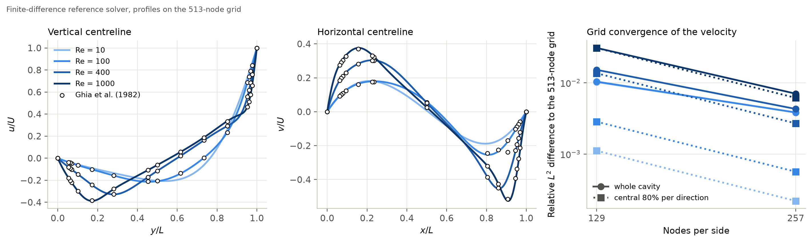
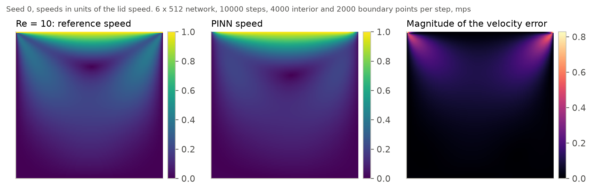
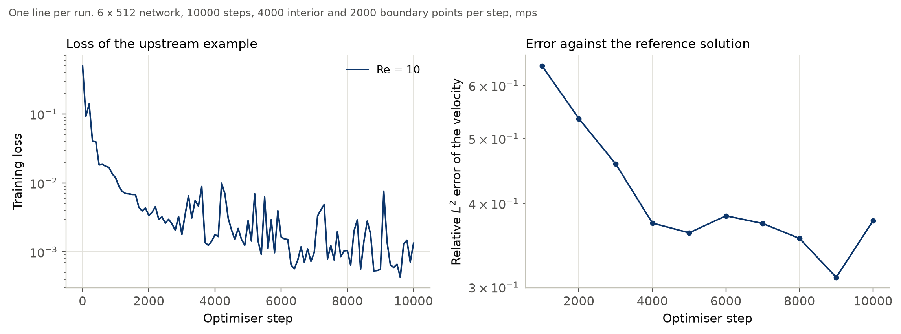
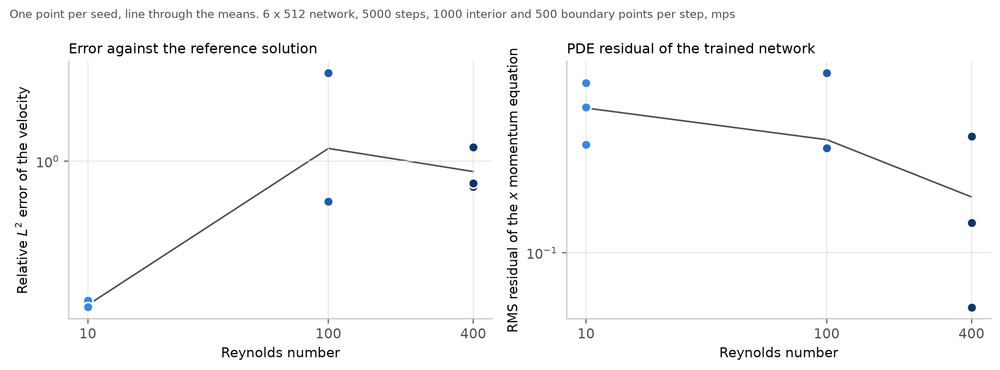
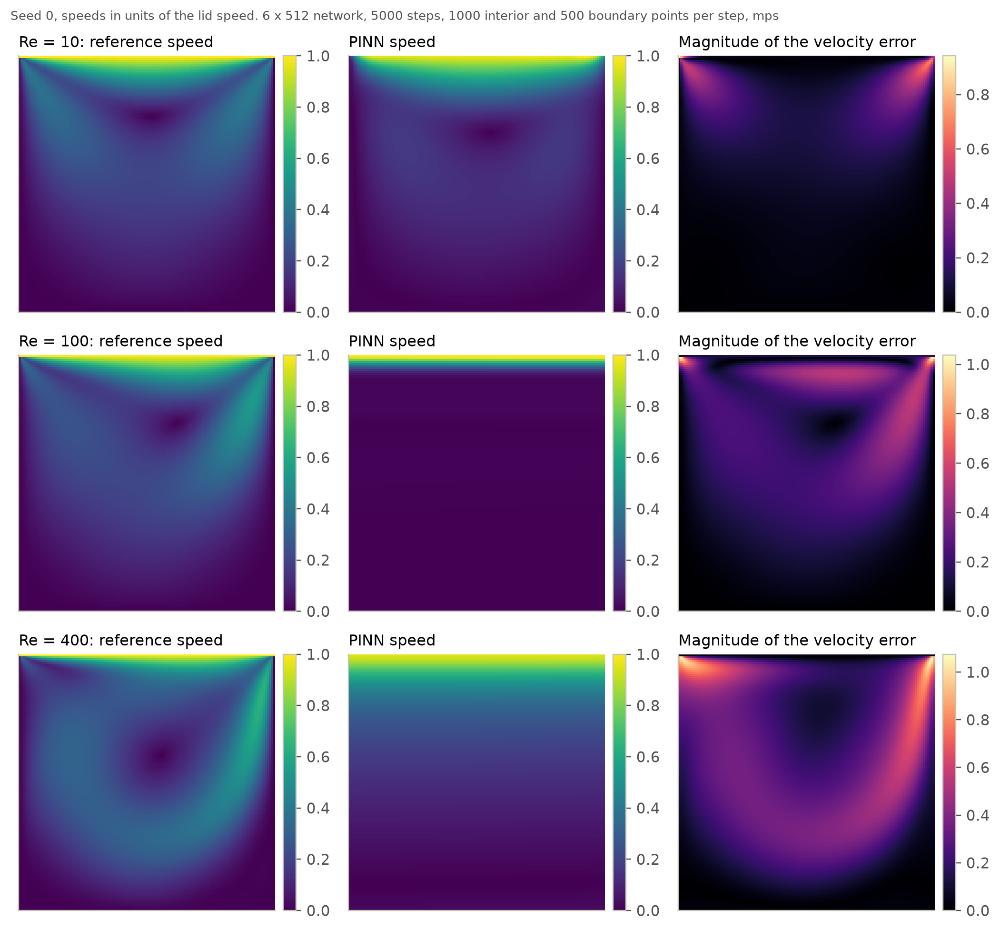
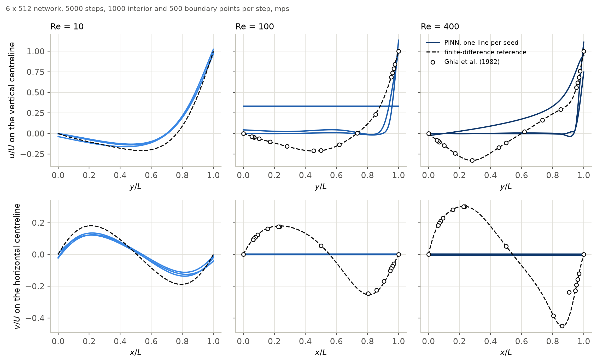
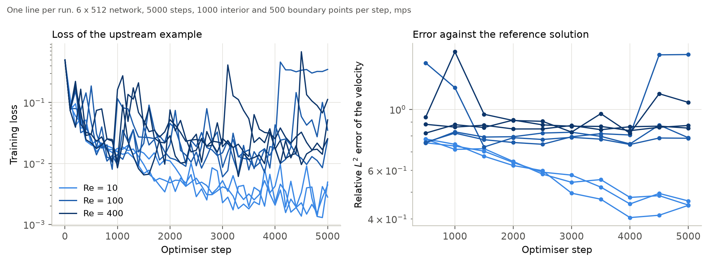
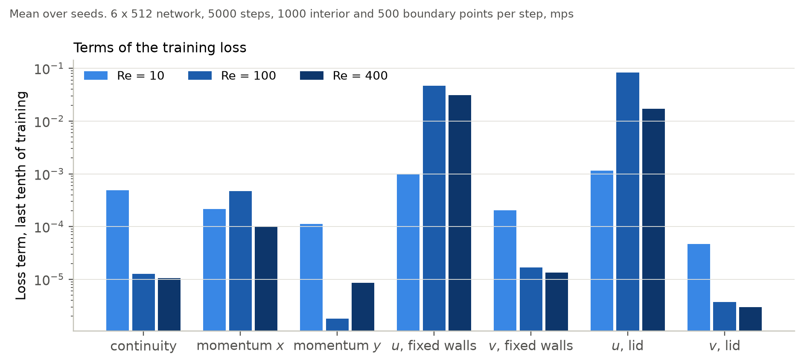

# Reynolds-Number Study of the PhysicsNeMo Lid-Driven-Cavity PINN

A controlled experiment built on the physics-informed neural network (PINN) example for lid-driven cavity flow of [NVIDIA PhysicsNeMo](https://github.com/NVIDIA/physicsnemo). The network, the PDE residuals, the geometry sampling and the loss are PhysicsNeMo's. This repository adds a Reynolds number as the single varied parameter, a verified finite-difference reference solution to measure the error against, and records of every run.

**Question.** How accurate is the velocity field that the example's training recipe produces, and how does that accuracy change with the Reynolds number when nothing else is changed?

## Studies

| Study | Configuration | Reynolds numbers | Seeds | Device | Run |
|---|---|---|---|---|---|
| Upstream settings | `configs/official.yaml` | 10 | 1 | Apple MPS | yes |
| Reduced study | `configs/local.yaml` | 10, 100, 400 | 3 | Apple MPS | yes |
| Study at the upstream settings | `configs/full.yaml` | 10, 100, 400 | 3 | CUDA | no |
| Reference solver checks | `scripts/verify_reference.py` | 10, 100, 400, 1000 | | CPU | yes |

All numbers in [Results](#results) come from the first two studies. No CUDA result is reported.

## Motivation

A PINN represents the solution of a PDE by a network and trains it by penalising the PDE residual at random points together with the boundary conditions; no solution data are used. The lid-driven cavity is a standard first test of this approach for the Navier-Stokes equations. The NVIDIA example shows how the pieces fit together in PhysicsNeMo and reports pictures of the predicted fields, at one viscosity. Two things are not part of it: a number for the error of the result, and the behaviour away from that viscosity. Both matter for anyone starting from the example, because the loss of a PINN can be small while the solution is wrong.

## Governing PDE

Steady incompressible flow in a square cavity whose top wall moves at constant speed:

$$\nabla\cdot\mathbf{u} = 0, \qquad (\mathbf{u}\cdot\nabla)\,\mathbf{u} + \frac{1}{\rho}\nabla p - \nu\,\Delta\mathbf{u} = 0 \quad \text{in } \Omega = \left(-\tfrac{L}{2}, \tfrac{L}{2}\right)^2,$$

$$\mathbf{u} = (U, 0) \ \text{on the lid } y = \tfrac{L}{2}, \qquad \mathbf{u} = 0 \ \text{on the other three walls},$$

with $L = 0.1$, $U = 1$ and $\rho = 1$ as in the example. The only dimensionless parameter is the Reynolds number

$$\mathrm{Re} = \frac{U L}{\nu}.$$

The example fixes $\nu = 0.01$, which is $\mathrm{Re} = 10$. Here $\nu = U L / \mathrm{Re}$ is set from the Reynolds number and $U$, $L$ and $\rho$ are left unchanged.

## Model

`physicsnemo.models.mlp.FullyConnected` with the settings of the example: two inputs $(x, y)$, three outputs $(u, v, p)$, six hidden layers of width 512, SiLU activations, 1 316 355 parameters. The inputs are the physical coordinates in $[-0.05, 0.05]$, without normalisation.

## Original NVIDIA example

| | |
|---|---|
| Example | [`examples/cfd/ldc_pinns`](https://github.com/NVIDIA/physicsnemo/tree/b45a5c810c741e6b41f8515be24c51121f8fc21f/examples/cfd/ldc_pinns) (`train.py`, `config.yaml`, `README.md`) |
| PhysicsNeMo commit | `b45a5c810c741e6b41f8515be24c51121f8fc21f` (main branch, 2 October 2026, version `2.3.0a0`) |
| Licence | Apache-2.0 |

The original trains one network for 10 000 steps of Adam. At every step it draws 4000 points in the cavity and 2000 on its boundary with `physicsnemo.mesh`, evaluates the residuals of continuity and of the two momentum equations with `physicsnemo.sym`'s `PhysicsInformer` (automatic differentiation), and minimises

$$\mathcal{L} = \sum_{r \in \{\text{cont},\, \text{mom}_x,\, \text{mom}_y\}} \overline{\bigl(d\, r\bigr)^2} \;+\; \overline{u^2}\big|_{\text{walls}} + \overline{v^2}\big|_{\text{walls}} \;+\; \overline{w\,(u - U)^2}\big|_{\text{lid}} + \overline{v^2}\big|_{\text{lid}},$$

where overlines are means over the sampled points, $d$ is the distance to the nearest wall and $w = 1 - 2|x|/L$ falls from 1 at the centre of the lid to 0 at its corners. The learning rate starts at $10^{-3}$ and is multiplied by $0.95^{1/4000}$ per step, which leaves $0.88 \times 10^{-3}$ after 10 000 steps. Every 1000 steps a figure of $u$, $v$, $p$ and the speed is saved. The trained network is not saved and no error is computed.

Properties of the original that matter for reading the results:

- **The residual terms carry small weights.** $d \le L/2 = 0.05$, so each squared residual is multiplied by at most $2.5 \times 10^{-3}$, and by less near the walls. The boundary terms have weight 1.
- **Only one key of `config.yaml` is read.** `train.py` uses `scheduler.initial_lr`. The `arch` block describes a Fourier neural operator that the script does not build, and `scheduler.decay_rate` is not the decay that is applied. Network size, viscosity, point counts, step count and decay are constants in `train.py`.
- **The run is not seeded**, and the device is CUDA or CPU as chosen by `DistributedManager`.

## What this repository changes

Original NVIDIA implementation, used through the installed package and not copied:

- the network (`physicsnemo.models.mlp.FullyConnected`);
- the mesh and the point sampling (`physicsnemo.mesh`: `structured_grid.load`, `get_boundary_mesh`, `sample_random_points_on_cells`);
- the symbolic PDE base class and the residual evaluation (`physicsnemo.sym`: `PDE`, `PhysicsInformer`);
- `save_checkpoint` and `load_checkpoint`.

Adapted from the NVIDIA example, with the NVIDIA licence header kept and the changes stated in each file:

- `configs/official.yaml`: the upstream `config.yaml`, text unchanged, with added keys below a marker. The added keys hold the constants of the upstream `train.py`;
- `src/pinn_cavity/equations.py`: the class `NavierStokes`, body unchanged;
- `src/pinn_cavity/engine.py`: geometry and sampling, network construction, the loss and the optimisation loop. `tests/test_engine.py` recomputes the loss with the lines of the upstream script and compares.

Extensions and experiments in this repository:

1. **Reynolds-number study.** $\mathrm{Re} \in \{10, 100, 400\}$ through the viscosity, three seeds each, everything else fixed.
2. **Reference solution.** A finite-difference solver for the same problem, independent of PhysicsNeMo and of the network, checked against published benchmark values before use (see [Reference solution](#reference-solution)).
3. **Evaluation.** Relative $L^2$ error of the velocity against the reference, centreline profiles, boundary-condition errors, unweighted PDE residuals, the seven terms of the loss recorded separately, and the velocity error tracked during training.
4. **Seeding and records.** Every run is seeded and writes its history, metrics and a checkpoint; every study writes its environment and configuration.
5. **Explicit device.** The device is a configuration key, so the pipeline also runs on Apple MPS.

Not carried over from the original: the figure saved every 1000 steps, the `DistributedManager`, and the unused imports.

### Choice of Reynolds numbers

$\mathrm{Re} = 10$ is the value of the example and is the control. $\mathrm{Re} = 100$ and $\mathrm{Re} = 400$ are the two lowest values tabulated by Ghia et al. (1982): the flow is steady and two-dimensional, the primary vortex moves from the upper part of the cavity towards its centre, and the balance shifts from diffusion towards convection, with the viscous term of the momentum residual 10 and 40 times smaller than in the example. $\mathrm{Re} = 1000$ and above are left out: the reference solver is verified at 1000, but the outcome at 100 and 400 already answers the question for this recipe.

## Reference solution

`src/pinn_cavity/reference.py` solves the stream-function and vorticity form of the same equations on a uniform grid of the unit square: second-order central differences, Thom's formula for the wall vorticity, and Newton's method with a sparse direct solve of the full Jacobian, with continuation in the Reynolds number. The result is mapped to the cavity of the example by $x = (x^\ast - \tfrac12) L$ and $\mathbf{u} = U \mathbf{u}^\ast$. The studies use 513 nodes per side.

`scripts/verify_reference.py` checks the solver on 129, 257 and 513 nodes; its output is in [`results/reference_check.json`](results/reference_check.json).

**Published extrema.** Extrema of the centreline velocity profiles and of the stream function, Richardson-extrapolated from the 257 and 513 grids, against the spectral solution of Botella and Peyret (1998) at $\mathrm{Re} = 1000$ and the extrapolated finite-volume solution of Marchi et al. (2009) at $\mathrm{Re} = 100$:

| Quantity | $\mathrm{Re} = 100$, this solver | Published | $\mathrm{Re} = 1000$, this solver | Published |
|---|---|---|---|---|
| Minimum of $u$ on the vertical centreline | −0.2140424 | −0.2140417 | −0.388575 | −0.3885698 |
| Maximum of $v$ on the horizontal centreline | 0.1795730 | 0.1795728 | 0.376953 | 0.3769447 |
| Minimum of $v$ on the horizontal centreline | −0.2538033 | −0.2538030 | −0.527082 | −0.5270771 |
| Minimum of the stream function | −0.103520 | | −0.118938 | −0.1189366 |

On the 513 grid without extrapolation the same quantities are within $6 \times 10^{-5}$ of the published values at $\mathrm{Re} = 100$ and within $1.1 \times 10^{-3}$ at $\mathrm{Re} = 1000$.

**Grid convergence.** Relative $L^2$ difference of the velocity between the 257 and the 513 grid:

| | $\mathrm{Re} = 10$ | $\mathrm{Re} = 100$ | $\mathrm{Re} = 400$ | $\mathrm{Re} = 1000$ |
|---|---|---|---|---|
| Whole cavity | 0.38% | 0.38% | 0.43% | 0.70% |
| Central 80% per direction | 0.022% | 0.056% | 0.27% | 0.61% |

Over the whole cavity the difference is dominated by the nodes next to the two upper corners, where the boundary velocity is discontinuous. Away from the walls it shrinks by a factor of 5.0 to 5.1 from the 129 to the 257 grid. The reference is therefore accurate to a few tenths of a percent in the norm used below, which is two orders of magnitude below the errors it is used to measure.

**Tables of Ghia et al. (1982).** Root-mean-square difference between the 513-grid centreline profiles and the 17 tabulated values per profile: 0.001 to 0.003 in $u$ and 0.003 to 0.009 in $v$ at $\mathrm{Re} = 100$, 400 and 1000, in units of the lid speed. One tabulated value, $v$ at $x = 0.9063$ for $\mathrm{Re} = 400$, differs by 0.15 from the solver on every grid and from its neighbours in the table; it is kept in the table, shown in the figures and excluded from that range. The tables are used as a second check and for plotting; the errors of the networks are measured against the solver.



*Centreline profiles of the reference solver with the values of Ghia et al., and the grid convergence of the velocity field.*

## Experimental design

One factor is varied: the Reynolds number, through the viscosity. Each value is trained with seeds 0, 1 and 2. A seed fixes the initial weights and the sequence of collocation points.

| | `smoke` | `local` | `official` | `full` |
|---|---|---|---|---|
| Purpose | pipeline check | reduced study | upstream settings | study at the upstream settings |
| Reynolds numbers | 10, 100 | 10, 100, 400 | 10 | 10, 100, 400 |
| Seeds | 1 | 3 | 1 | 3 |
| Network | 6 × 32 | 6 × 512 | 6 × 512 | 6 × 512 |
| Steps | 40 | 5000 | 10 000 | 10 000 |
| Interior / boundary points per step | 256 / 128 | 1000 / 500 | 4000 / 2000 | 4000 / 2000 |
| Learning rate and decay per step | upstream | upstream | upstream | upstream |
| Reference grid | 33 | 513 | 513 | 513 |
| Device | CPU | MPS, CUDA or CPU | any | CUDA |
| Run in this repository | yes | yes | yes | no |

`official` is the example as shipped plus a seed. `full` differs from it only in the list of Reynolds numbers and seeds, so its run at $\mathrm{Re} = 10$ with seed 0 has the settings of `official`. `local` keeps the network, the loss, the optimiser and the decay, and reduces the points per step to a quarter and the steps to a half; a step of the upstream recipe takes about 0.5 s on the laptop used here.

Metrics per run:

- relative $L^2$ error of the velocity on the 513 × 513 nodes of the reference grid,
  $$\varepsilon = \frac{\lVert \hat{\mathbf{u}} - \mathbf{u}_{\text{ref}} \rVert_2}{\lVert \mathbf{u}_{\text{ref}} \rVert_2},$$
  over the whole cavity and over its central part (at least $0.1\,L$ from every wall);
- root-mean-square error of $u$ on the vertical and of $v$ on the horizontal centreline, in units of $U$, and the differences to the tabulated values of Ghia et al. where they exist;
- root-mean-square error of the boundary conditions on the lid and on the fixed walls, without the weight $w$;
- root-mean-square PDE residuals at the centres of a 128 × 128 grid of cells, without the weight $d$, made dimensionless with $L$ and $U$;
- the loss and its seven terms every 100 steps, and the velocity error on 129 × 129 nodes every 500 or 1000 steps;
- training time and inference time, with the device synchronised.

The pressure is not compared: the reference solver does not compute it.

## Installation

Python 3.11 to 3.14.

```bash
python -m venv .venv
source .venv/bin/activate
pip install -r requirements.txt
```

`requirements.txt` installs PhysicsNeMo with its `sym` extra from the pinned commit, with PyTorch, SymPy, Hydra, SciPy, Matplotlib and pytest.

## Smoke test

```bash
python -m pytest -q
python scripts/train.py --config smoke
python scripts/plot_results.py --study runs/smoke --out runs/smoke/figures
```

The smoke study trains two small networks for 40 steps and takes a few seconds on a CPU. Its numbers are not results. Arguments after the options are Hydra overrides of the configuration, for example `python scripts/train.py --config smoke device=mps training.steps=200`.

## Full training

Reduced study and the upstream settings, on a laptop:

```bash
python scripts/train.py --config local
python scripts/train.py --config official
```

Study at the upstream settings, on a CUDA GPU:

```bash
python scripts/train.py --config full
```

`--resume` skips runs that already finished. The first use of a Reynolds number computes its reference solution (one to two minutes on the 513 grid) and caches it under `data/`.

### GPU workflow on Kaggle

[`kaggle/run_cuda.ipynb`](kaggle/run_cuda.ipynb) is a launcher: it checks out one commit of this repository and calls its scripts. It contains no model or training code. It has been checked statically (`tests/test_notebook.py`) and has not been executed on Kaggle.

1. Create a Kaggle notebook from `kaggle/run_cuda.ipynb`. Session options: **Accelerator** an NVIDIA GPU, **Internet** on.
2. In the first code cell set `REF` to the full 40-character SHA of the commit to run (`git rev-parse HEAD`). Branch and tag names are refused. For a private repository, store a GitHub token as a Kaggle secret and put the name of the secret in `GITHUB_TOKEN_SECRET`.
3. Set `SESSION_BUDGET_HOURS` to the GPU time available for the session, and `RUN_FULL` as needed.
4. Run all.

| Step | Command run by the notebook | Runs when | Output in `/kaggle/working` |
|---|---|---|---|
| A | `python -m pytest -q`, a CUDA smoke study, a 200-step timing probe at the upstream settings | always | |
| B | `python scripts/train.py --config full --resume device=cuda` | `RUN_FULL = True` | `physicsnemo-pinn-cavity-full.zip`, `physicsnemo-pinn-cavity-full-eval-bundle.zip` |

Before B the notebook projects the runtime from the probe and compares it with what is left of `SESSION_BUDGET_HOURS`. If the projection does not fit, the step is not started and the configuration is not reduced. `<name>.zip` holds the records that are tracked in `results/`; `<name>-eval-bundle.zip` holds the final checkpoint of every run and is not tracked.

### Integrating GPU results

From the repository root, with the archives downloaded to `~/Downloads`:

```bash
cp ~/Downloads/physicsnemo-pinn-cavity-full.zip runs/full.zip
python scripts/results.py publish runs/full.zip
unzip ~/Downloads/physicsnemo-pinn-cavity-full-eval-bundle.zip -d .
unzip runs/full.zip -d runs
python scripts/evaluate.py --config full --verify device=mps
python scripts/plot_results.py --study results/full --out figures
python -m pytest -q
```

`--verify` recomputes the velocity error of every run from its checkpoint, with a reference solution computed on the local machine, and compares it with the stored value. It writes nothing, so the timings and memory figures of the GPU run are kept.

## Evaluation

`scripts/train.py` evaluates every run after training. The evaluation can be repeated from the checkpoints:

```bash
python scripts/evaluate.py --config local
python scripts/plot_results.py --study runs/local --out runs/local/figures
python scripts/verify_reference.py
```

`evaluate.py` writes `summary.csv`, `summary.json` and `fields.npz` to the study directory. [`results/README.md`](results/README.md) describes the files and the units.

## Results

Two studies were run, both on an Apple M3 Pro with MPS, from a clean checkout of commit `ec3199d`. They differ in training budget and must be read separately.

- **Upstream settings** (`configs/official.yaml`): the example as shipped, $\mathrm{Re} = 10$, 10 000 steps, 4000 interior and 2000 boundary points per step, seed 0. Source: [`results/official/summary.csv`](results/official/summary.csv).
- **Reduced study** (`configs/local.yaml`): $\mathrm{Re} \in \{10, 100, 400\}$, three seeds, 5000 steps, 1000 interior and 500 boundary points per step. Source: [`results/local/summary.csv`](results/local/summary.csv).

| Study | Re | Seed | Velocity error | Velocity error, core | Error of $v$ | Continuity residual | $x$ momentum residual | Fixed walls, RMS | Lid, RMS | Final loss |
|---|---|---|---|---|---|---|---|---|---|---|
| upstream settings | 10 | 0 | 38.3% | 48.4% | 45.0% | 0.745 | 0.720 | 0.023 | 0.129 | 1.3e-03 |
| reduced | 10 | 0 | 47.3% | 57.2% | 58.9% | 0.784 | 0.501 | 0.051 | 0.148 | 5.0e-03 |
| reduced | 10 | 1 | 45.6% | 53.9% | 52.3% | 0.978 | 0.655 | 0.030 | 0.140 | 2.8e-03 |
| reduced | 10 | 2 | 45.6% | 55.2% | 56.4% | 0.833 | 0.332 | 0.036 | 0.158 | 4.4e-03 |
| reduced | 100 | 0 | 80.2% | 101.2% | 100.1% | 0.110 | 0.731 | 0.130 | 0.132 | 2.5e-02 |
| reduced | 100 | 1 | 80.5% | 107.0% | 100.0% | 0.070 | 0.318 | 0.149 | 0.013 | 3.5e-02 |
| reduced | 100 | 2 | 160.7% | 215.4% | 100.0% | 0.000 | 0.000 | 0.333 | 0.667 | 3.5e-01 |
| reduced | 400 | 0 | 107.8% | 117.9% | 100.0% | 0.025 | 0.055 | 0.250 | 0.049 | 1.1e-01 |
| reduced | 400 | 1 | 87.1% | 100.1% | 100.1% | 0.034 | 0.362 | 0.124 | 0.108 | 2.5e-02 |
| reduced | 400 | 2 | 88.9% | 100.3% | 100.0% | 0.040 | 0.140 | 0.080 | 0.255 | 5.2e-02 |

Errors are relative $L^2$ errors against the reference solution on 513 × 513 nodes; "core" is the part of the cavity at least $0.1\,L$ from every wall. Residuals are root-mean-square values without the distance weight, in units of $U/L$ and $U^2/L$. Boundary errors are in units of $U$, without the lid weight. The final loss is the value at the last step, with the weights of the example. The error of the reference itself is about 0.4% in this norm (see [Reference solution](#reference-solution)).

Mean and sample standard deviation over the three seeds of the reduced study:

| Re | Velocity error | Range over seeds | Centreline $u$, RMS | Centreline $v$, RMS |
|---|---|---|---|---|
| 10 | 46.2% ± 1.0% | 45.6% to 47.3% | 0.070 | 0.044 |
| 100 | 107% ± 46% | 80.2% to 160.7% | 0.270 | 0.152 |
| 400 | 94.6% ± 11.4% | 87.1% to 107.8% | 0.231 | 0.246 |

### The example at its own settings



*$\mathrm{Re} = 10$, upstream settings: reference speed, predicted speed and magnitude of the velocity error.*



*Loss and velocity error against the step for the run at the upstream settings.*

With the budget of the example, the velocity error at $\mathrm{Re} = 10$ is 38.3%. The predicted flow has the right structure, one vortex below the lid, with too little circulation: the minimum of $u$ on the vertical centreline is −0.130 against −0.208 in the reference. The tracked error falls from 64% at step 1000 to 37% at step 4000 and then stays between 31% and 38% for the remaining 6000 steps, while the loss, averaged over 1000 steps, falls from $3.8 \times 10^{-3}$ to $1.6 \times 10^{-3}$.

### Reduced study



*Reduced study. Velocity error and unweighted residual of the $x$ momentum equation, one point per seed. The run that collapsed to a constant has a residual of exactly zero and is absent from the logarithmic right panel.*



*Reduced study, seed 0. Speeds share a colour scale; each error panel has its own.*



*Reduced study. Velocity on the two centrelines for every seed, with the reference solver and the tabulated values of Ghia et al.*



*Reduced study. Loss and velocity error against the step, one line per run.*



*Reduced study. The seven terms of the loss, averaged over the last tenth of training and over seeds.*

## Interpretation

The statements below are about this network, this loss and this optimisation recipe, at the budgets that were run. They are not statements about PINNs in general, and the comparison across Reynolds numbers exists only at the reduced budget.

- **Budget is a factor at $\mathrm{Re} = 10$, and it does not close the gap.** Four times the points and twice the steps lower the error of seed 0 from 47.3% to 38.3%. The plateau after step 4000 indicates that more steps of the same recipe would not bring a large further gain; one seed is not enough to quantify this.
- **At $\mathrm{Re} = 100$ and $400$ the reduced runs do not find the cavity flow.** In all six of these runs the error against the reference is 80% or more, and the error of the vertical velocity is 100.0% to 100.1%: the predicted $v$ is essentially zero everywhere. Apart from the collapsed run described below, the networks represent a thin layer below the lid in which $u$ drops from the lid speed to about zero, above an interior at rest. In the central part of the cavity the error is 100% or more.
- **Lower residuals with higher errors.** The unweighted continuity residual is 0.74 to 0.98 in the four runs at $\mathrm{Re} = 10$ and 0.03 to 0.11 in the five higher-Reynolds runs that did not collapse, where the velocity error is about twice as large. A fluid at rest satisfies the equations exactly, and a unidirectional shear layer nearly does, so the residual does not distinguish these states from the solution. The mismatch is paid at the boundary instead: the loss at $\mathrm{Re} = 100$ and $400$ is dominated by the $u$ terms on the fixed walls and on the lid, which are on average 10 to 70 times larger than at $\mathrm{Re} = 10$.
- **One run collapsed.** Seed 2 at $\mathrm{Re} = 100$ follows the other two seeds until step 4000 (tracked error 75% to 82%). Between steps 4000 and 4100 its output becomes a constant, $u \approx 1/3$ and $v \approx 0$ everywhere: all three residuals are zero to machine precision, the loss rises from 0.02 to 0.34 and does not recover, and the velocity error ends at 161%. The run is seeded, finite and on protocol, and it is kept in every table and figure. It is the reason the standard deviation at $\mathrm{Re} = 100$ is 46 percentage points.
- **Seed sensitivity grows with the Reynolds number.** The range over seeds is 1.7 percentage points at $\mathrm{Re} = 10$ and 21 at $\mathrm{Re} = 400$; the recorded losses of the higher-Reynolds runs jump by factors of 6 to 47 between consecutive records, against 4 for seed 0 at $\mathrm{Re} = 10$.
- **A lower loss is not a proportionally lower error.** The run at the upstream settings ends with a loss 3.7 times lower than the reduced run of the same seed and Reynolds number, for an error that is lower by a fifth, and over its last 6000 steps the loss more than halves while the error does not trend.

Two features of the recipe are consistent with these observations and are not tested here as causes: the residual terms enter the loss with weights of at most $2.5 \times 10^{-3}$ against 1 for the boundary terms, and the viscous term that couples the lid to the interior is itself multiplied by $\nu$, which is 10 and 40 times smaller at the higher Reynolds numbers.

Whether the higher Reynolds numbers behave differently with the full budget of the example is the question of `configs/full.yaml`, which gives every Reynolds number and seed the 10 000 steps and the point counts of the original. It has not been run.

## Limitations

- The comparison across Reynolds numbers exists only at the reduced budget (half the steps and a quarter of the points of the example). It shows what this recipe does at that budget and does not establish a Reynolds-number limit of the method.
- The upstream settings were run for one seed and one Reynolds number. The spread over seeds at that budget is unknown.
- Only the viscosity is varied. Loss weights, network size, activation, learning rate, sampling and the unnormalised inputs are those of the example, and none of them is tested as a cause of the behaviour.
- Fixed training budgets, not converged runs. The reported errors are those of the last step; in several runs the tracked error was lower at an earlier step.
- The pressure is not evaluated. The reference solver uses the stream-function and vorticity form and does not produce it.
- The reference has a discontinuous boundary velocity at the two upper corners, while the loss of the example weights the lid condition down to zero there. Part of the error over the whole cavity sits at these corners; the error in the central part is reported separately for that reason.
- All runs used Apple MPS in single precision. Nothing has been run on CUDA, and results on different devices are not bitwise identical.
- Training and inference times were recorded while another training job was using the same machine, and the machine slept for seven hours during the evaluation of the reduced study. They are kept in the records and are not benchmarks; no timing result is reported. An isolated measurement before the studies gave about 0.5 s per step for the upstream recipe on MPS.
- The values of Ghia et al. were transcribed by hand. They are a secondary check; the solver is verified against the published extrema independently of them.

## Reproducibility

- Every study writes `study_metadata.json` with the UTC timestamp, the git commit and whether the tree was modified, the device, the Python, PyTorch, PhysicsNeMo (version and commit), NumPy, SciPy and SymPy versions, the resolved configuration, and a record of each reference solution.
- Seeds 0, 1, 2. The network is initialised on CPU and then moved to the device; the collocation points are drawn on the device from the same seed. A CPU training run repeats its final loss to a relative tolerance of $10^{-5}$ (`tests/test_pipeline.py`).
- Both studies ran from a clean checkout of commit `ec3199d`. The stored velocity errors of all ten runs were recomputed on CPU from the checkpoints with `scripts/evaluate.py --verify` and agree to a relative difference below $10^{-7}$.
- The `study_metadata.json` files of `local` and `official` were written after the studies had started and say so in `metadata_note`: the studies were launched with `--resume`, which at that commit did not write the record. Commit, environment and configuration are those of the runs; `timestamp_utc` is the time of writing. `--resume` now writes the record when none exists.
- Reference solutions are cached under `data/` with a key that covers the Reynolds number, the grid, the cavity size, the lid speed and a solver version. `data/`, `runs/` and checkpoints are not tracked.
- 46 tests cover the configurations, the equality of the loss with the upstream expression, the residuals against an analytic field, the reference solver, an end-to-end study and the Kaggle launcher.

Repository layout:

```text
configs/          official.yaml (upstream values), smoke.yaml, local.yaml, full.yaml
src/pinn_cavity/  config, equations, engine, study, reference, plotting, provenance
scripts/          train.py, evaluate.py, plot_results.py, results.py, verify_reference.py
tests/            configuration, loss and residuals, reference solver, end-to-end study, notebook
kaggle/           run_cuda.ipynb
results/          tracked summaries and records
figures/          tracked figures
```

## Acknowledgements and attribution

The network, the mesh and sampling utilities, the symbolic PDE and residual machinery, the checkpoint utilities and the example this study starts from are the work of the NVIDIA PhysicsNeMo team and contributors, released under the Apache License 2.0. Physics-informed neural networks were introduced by Raissi, Perdikaris and Karniadakis (2019). This repository contributes the experiment design, the reference solver and its checks, the evaluation and the documentation. It is not affiliated with or endorsed by NVIDIA.

Files adapted from PhysicsNeMo keep the NVIDIA copyright and licence header and state their changes; [`NOTICE`](NOTICE) lists them. The repository is released under the Apache License 2.0 ([`LICENSE`](LICENSE)).

## References

1. M. Raissi, P. Perdikaris, G. E. Karniadakis. *Physics-informed neural networks: A deep learning framework for solving forward and inverse problems involving nonlinear partial differential equations.* Journal of Computational Physics 378 (2019). [doi:10.1016/j.jcp.2018.10.045](https://doi.org/10.1016/j.jcp.2018.10.045)
2. PhysicsNeMo Contributors. *NVIDIA PhysicsNeMo: An open-source framework for physics-based deep learning in science and engineering.* [github.com/NVIDIA/physicsnemo](https://github.com/NVIDIA/physicsnemo)
3. U. Ghia, K. N. Ghia, C. T. Shin. *High-Re solutions for incompressible flow using the Navier-Stokes equations and a multigrid method.* Journal of Computational Physics 48 (1982). [doi:10.1016/0021-9991(82)90058-4](https://doi.org/10.1016/0021-9991(82)90058-4)
4. O. Botella, R. Peyret. *Benchmark spectral results on the lid-driven cavity flow.* Computers & Fluids 27 (1998).
5. C. H. Marchi, R. Suero, L. K. Araki. *The lid-driven square cavity flow: numerical solution with a 1024 x 1024 grid.* Journal of the Brazilian Society of Mechanical Sciences and Engineering 31 (2009).
6. A. Thom. *The flow past circular cylinders at low speeds.* Proceedings of the Royal Society A 141 (1933).
